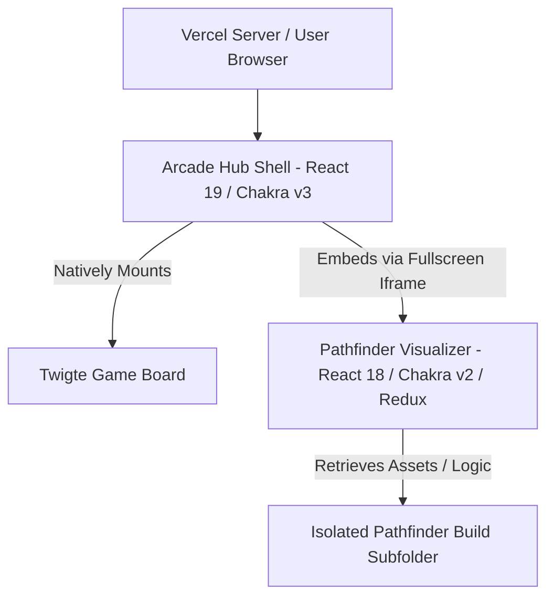

# 🎓 Interview Revision Sheet: Arcade Hub Portal
**Project Name**: Arcade Hub (Twigte & Pathfinder)  
**Architecture Style**: Micro-Frontend / Isolated Multi-App Monorepo  
**Tech Stack**: React 19, React 18, Chakra UI v3, Chakra UI v2, Redux Toolkit, Vite, Concurrently, Git, Vercel

---

## 📋 Executive Summary
Arcade Hub is a unified gaming portal hosting two distinct, interactive applications:
1. **Twigte Strategy Board Game**: A variation of Nine Men's Morris featuring concentric squares, diagonal paths, and capture-mill mechanics. (Native React 19 / Chakra UI v3)
2. **Pathfinder Visualizer**: A visual grid-mesh demonstrating shortest-path graph search algorithms (Dijkstra, A*, BFS, DFS) with obstacle drawing and weight node densities. (Embedded React 18 / Chakra UI v2)

---

## 🏗️ System Architecture & Design Patterns
Rather than forcing incompatible frontend versions to merge and rewrite hundreds of lines of code, the portal uses a **Micro-Frontend style isolation architecture via full-screen Iframe Sandboxing**.



### Why This Design Pattern Was Selected:
* **Dependency Conflict Resolution**: Resolves version mismatches (React 18 vs 19, Chakra v2 vs v3) without package installation errors.
* **Separation of Concerns**: Both apps remain entirely decoupled. They can be updated, debugged, and tested independently by separate teams.
* **Zero Migration Overhead**: Legacy codebases can be instantly imported into the main portal with zero refactoring.
* **No Cross-Origin Issues**: By outputting the compiled nested assets directly inside the root `public/` directory, both applications share the **same domain**. This eliminates sandboxing/CORS issues.

---

## ⚙️ How It Works: Development vs. Production

### 1. Local Development Orchestration
Both servers boot concurrently on different local ports using the `dev:all` script in the root `package.json`:
```json
"dev:all": "concurrently \"npm run dev\" \"npm run dev --prefix pathfinder/pathfinder -- --port 5174\""
```
* `concurrently` runs both commands in parallel in a single terminal.
* The `--prefix` flag runs the command inside the sub-project directory.
* The `-- --port 5174` forwards the port argument to Vite to start Pathfinder on `localhost:5174`.

### 2. Automated Production Build for Vercel
To deploy both apps under a single Vercel project, we created a nested build flow in the root `package.json`:
```json
"build": "npm install --prefix pathfinder/pathfinder && npm run build --prefix pathfinder/pathfinder && vite build"
```
When Vercel deploys, it compiles the project in three stages:
1. Installs Pathfinder's dependencies in its subfolder.
2. Compiles Pathfinder. Because of Pathfinder's `vite.config.js` configuration:
   * **`base: '/pathfinder/'`** prefix is added to all asset imports.
   * **`outDir: '../../public/pathfinder'`** saves the compiled build directly inside the main project's public folder.
3. Builds the main portal. Vite automatically moves everything inside the `public/` directory into the final `dist/` production folder.

---

## 🧬 Game Details & Core Mechanics

### Twigte (Concentric Alignment Game)
* **The Board**: Represented by 3 concentric squares containing 24 playable nodes, connected by 20 path lines (including corner-to-corner diagonals).
* **Game Phases**:
  1. *Placement Phase*: Players take turns placing 9 tokens on empty cells.
  2. *Movement Phase*: Once all tokens are placed, players click their own token and select an adjacent empty cell to move.
* **Mill Rule**: Placing 3 tokens in a line forms a "mill". The player is prompted (via a controlled modal) to select and capture an opponent's token.
* **Win Condition**: A player wins when the opponent is reduced to 2 tokens, or is completely trapped (no legal moves).

### Pathfinder Visualizer
* **Algorithms Implemented**:
  * *Dijkstra's*: Weighted algorithm, guarantees the absolute shortest path.
  * *A\**: Weighted algorithm with a Manhattan heuristic, optimized for speed.
  * *BFS*: Unweighted algorithm, guarantees the shortest path on simple grids.
  * *DFS*: Unweighted algorithm, explores deep paths, does not guarantee shortest path.
* **Mazes & Weights**: Generates recursive division mazes or randomized weighted grids using Redux-managed states (`cellSlice.js` & `algoSlice.js`).

---

## 🎯 Cracking the Tech Interview: Q&A

**Q: Why didn't you use Module Federation (Webpack 5) or Single-SPA instead of an Iframe?**  
> *"While Module Federation is highly scalable, it requires both apps to share standard Webpack bundlers and compatible runtime libraries. Here, the React version difference (React 18 vs 19) is a major issue because React 19 uses a different rendering architecture and scheduler. An iframe provided absolute runtime isolation, ensuring that neither app could leak styles or clash on global React contexts."*

**Q: How did you handle asset resolution inside the Pathfinder iframe for production?**  
> *"We configured the `base` path in Pathfinder's `vite.config.js` to `/pathfinder/`. This forces Vite to generate asset imports prefixed with `/pathfinder/assets/` rather than `/assets/`, ensuring that the browser resolves them relative to the nested portal path instead of the root directory."*

**Q: How does the application switch between development ports and production paths?**  
> *"In the root `App.jsx`, we use Vite's built-in env checker `import.meta.env.DEV`. If true, the iframe src is set to `http://localhost:5174` for hot reloading. In production, it points to the relative path `/pathfinder/index.html` which is served statically."*
